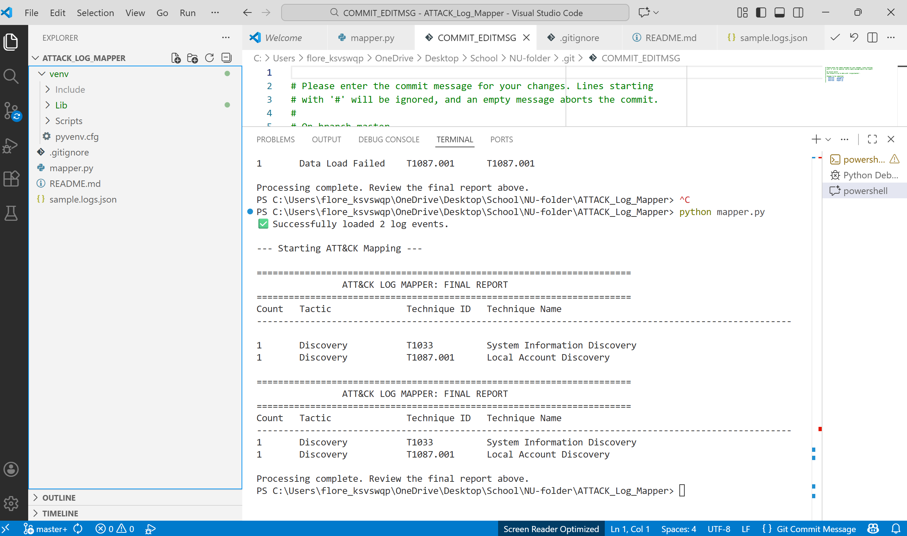

# Automated MITRE ATT&CK Log Mapper

## 📌 Overview
The Automated MITRE ATT&CK Log Mapper is a Python-based security automation tool designed to bridge the gap between raw system telemetry and actionable defense. By transforming noisy system event logs into high-fidelity threat intelligence, this tool automates the tedious manual review process inherent in detection engineering. It identifies security-relevant events and maps them directly to the Tactics and Techniques defined within the MITRE ATT&CK knowledge base.

## 🎯 Project Objectives

**Robust Log Parsing:** Ingests structured JSON logs using defensive programming to ensure stability against malformed data.

**Automated Correlation:** Matches security-relevant events to MITRE ATT&CK Tactics and Techniques using a modular rule engine.

**Dynamic Intelligence:** Utilizes the mitreattack-python library to fetch live, human-readable descriptions for observed attacker behaviors.

## ✨ Key Features

**Modular Rule Set:** Uses an expandable Python dictionary for "separation of concerns," allowing for rapid updates to security rules without modifying core logic.

**Actionable Reporting:** Generates a summarized terminal report that prioritizes critical findings for incident responders.

**Scalable Architecture:** Designed with a "future-ready" mindset for potential machine learning integration for anomaly detection.

## 🛠️ Setup and Running Instructions

### Prerequisites
- Python 3.x 
- Virtual Environment (venv) for dependency isolation

### Installation

1. **Clone the Repository:**
   ```bash
   git clone https://github.com/flogood/NU-folder.git
   cd ATTACK_Log_Mapper
   ```

2. **Setup Virtual Environment:**
   ```bash
   python -m venv venv
   .\venv\Scripts\activate  # Windows
   source venv/bin/activate # macOS/Linux
   ```

3. **Install Dependencies:**
   ```bash
   pip install mitreattack-python stix2
   ```

4. **Download MITRE ATT&CK Data:**
   ```bash
   # Windows PowerShell
   Invoke-WebRequest -Uri "https://raw.githubusercontent.com/mitre/cti/master/enterprise-attack/enterprise-attack.json" -OutFile "enterprise-attack.json"
   
   # macOS/Linux
   wget https://raw.githubusercontent.com/mitre/cti/master/enterprise-attack/enterprise-attack.json
   ```

### Usage

1. Ensure your input data is located in `sample.logs.json` in the root directory.

2. Execute the mapper:
   ```bash
   python mapper.py
   ```

## 📊 Sample Output

When you run the mapper, you'll see output similar to this:



The report shows detected techniques with their corresponding tactics, providing immediate insight into potential threats in your environment.

## ⚠️ Project Challenges & Learning

This project involved overcoming significant technical hurdles, including:

**Environment Management:** Resolving Git repository instability caused by cloud-syncing conflicts and managing large virtual environment directories.

**Data Robustness:** Implementing layered try...except blocks to handle unpredictable JSON formatting and ensure graceful error handling.

**Framework Integration:** Navigating complex STIX 2.1 data structures to provide human-readable threat context from the MITRE ATT&CK framework.

## 🚨 API Keys Notice
This project uses publicly available MITRE ATT&CK data and does not require any private API keys. No secrets are stored in this repository.